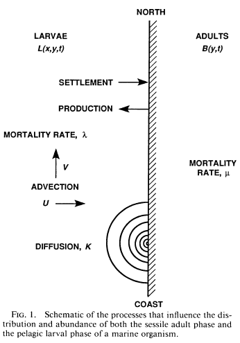

Useful resources for equations in Rmarkdown:
http://www.statpower.net/Content/310/R%20Stuff/SampleMarkdown.html
http://reu.dimacs.rutgers.edu/Symbols.pdf
http://www.calvin.edu/~rpruim/courses/m343/F12/RStudio/LatexExamples.html

library(bookdown) 

# Math for dispersal modeling 

## From Possingham and Roughgarden 1990: 

Relevant manuscript excerpts - these 20th-century papers are far more eloquent than I: 

### introduction 

Our study differs from these efforts because it is the first to pertain to an organism whose adult phase is benthic and whose larvae are embedded in a circulation field in the water column. Benthic processes (competition for space during settlement, benthic mortality) affect the adults, and water column processes (diffusion, advection, and larval mortality) affect the larvae. The two stages are coupled in that benthic organisms release larvae into the water column and larval organisms settle into the benthic habitat. The focus of this article, therefore, is on the interaction of benthic and water column processes in determining population dynamics. The parameters in this study are based roughly on data from the rocky intertidal barnacle _Balanus glandular_.

Assume that the adults occur along a straight coast coincident with the $y$-axis. Larvae are produced by the adults, disperse in the water column, and may settle where they strike the coastline. In the water column the movement of larvae is governed by two forces, diffusion and advection. The advection of the larvae is determined by simple models of coastal water flow. On settling, the larvae metamorphose into adults.

Previously, the conditions for the persistence of a single homogeneous population distributed along the coast were shown to depend on the production rate of larvae per adult, the rate at which larvae settle, and the mortality rates of larvae and adults (Roughgarden and Iwasa 1986). In a one-dimensional model we show here that the rate at which larvae diffuse in the water column also affects the population's viability. This model illustrates how total "larval wastage" (Strath- mann 1985, Young and Chia 1987) results from the interaction of larval mortality and diffusion.

Three major assumptions are: 

1. The coast is straight and coincident with the $y$-axis such that the larvae disperse in a water column defined by the semi-infinite plane $x \leq 0$ and $-\infty < y < \infty$. 
2. The model water column is two dimensional, as appropriate for larvae that remain in a particular depth interval (Grosberg 1982, Banse 1986, but see Rothlisberg et al. 1983). 
3. The biological parameters for both the larvae and the adults are age-integrated averages.

### population modeling component 

Roughgarden and Iwasa (1986) described a population model for a sessile marine invertebrate with a pelagic larval phase. Adults along the coast die at rate $\mu$ and produce larvae at average rate $m$. Larvae settle on the coast at a rate that is proportional to the product of the amount of free space available, $F(t)$, and the concentration of larvae in the water column, where the constant of proportionality is $c$. In the water column the larvae die at a density-independent rate $\lambda$. Using these assumptions the equations for the dynamics of the species are (EQN1A, B, C):

$$ dB(t)/dt = cF(t)L(t) - \mu B(t), $$
$$ A \equiv F(t) + aB(t), $$ 
and 
$$ dL(t)/dt = mB(t) - \lambda L(t) - cF(t)L(t) $$ 

Where $B(t)$ is the number of adults at time $t$, $L(t)$ is the number of larvae at time $t$, $A$ is the total available free space, and $a$ is the average space occupied by a single adult barnacle. 

Roughgarden and Iwasa (1986) show that the equilibrium state for this single population is 

$$ \hat{B} = \frac{A}{a} \left[1-\frac{\lambda \mu}{cA(m-\mu)} \right] $$

and $$\hat{L} = (m - \mu)\hat{B}\lambda$$ 

which is globally stable if positive. 

The condition for a positive equilibrium population size is 

$$ cA(m/\mu - 1) > \lambda$$ 

In the equation above, $A$ is measured in units of space so that the settlement coefficient, $c$, is measured in units of $space^{-1} * time^{-1}$. 

### A model with spatially structured larvae

Consider the same problem but with the larvae distributed in one-dimensional space. Suppose the adult population exists at a fixed point on the coast and the larvae diffuse away from the coast in the x-direction. The larval population is now indexed in both space and time. A well-known approximation to the diffusion of a passive particle in a medium is the heat equation (Okubo 1980). To this equation we incorporate larval death at rate \lambda, 

$$ \frac{\partial L(x,t)}{\partial t} = \frac{K\partial ^{2} L(x,t)}{\partial x^{2}} - \lambda L(x,t) $$
where $K$ is the eddy diffusion coefficient (see Jackson and Strathmann 1981). To solve this equation we need to specify a boundary condition at the coast. Along the coast larvae settle, and larvae are produced by the adult phase of the population. The rate of flow of barnacles at the coast in an outwardly normal direction, as a result of larval production, is $m(t)B(t)$. Let the rate of settlement of larvae be $cL(0,t)F(t)$, where $c$ is the constant of proportionality. Hence, the net flux of larvae across the coastal boundary in an outwardly normal direction is: 

$$ \frac{K\partial L(x,t)}{\partial x} \bigg|_{x=0} = mB(t) - cF(t)L(0,t), $$
when $t>0$. 

The "larval settlement coefficient," $c$, may be interpreted here analogously to heat transfer where the product $cF(t)$ represents the "surface heat transfer coefficient." When $cF(t) = 0$, no larvae settle; all are reflected back into the water column on contact with the coast. As $cF(t)$ approaches infinity, the boundary becomes an absorbing barrier, and any larvae that strike it settle.

As before, the adult population increases as a result of settlement. Now, however, the rate of settlement depends only on the larval concentration at the coast $L(O, t)$, not the entire larval pool,

$ dB(t)/dt = cF(t)L(0,t) - \mu B(t) $, when $t >0$. 

Finally, the equation describing the available free space remains unaltered, 

$$ A \equiv F(t) + aB(t) $$

The equilibrium solution of the preceding 4 equations is: 

$$  \hat{B} = \frac{A}{a} \left[1-\frac{\mu \sqrt{\lambda K}}{cA(m-\mu)} \right] $$
$$ \hat{L}x = \hat{L}(0)^{x\sqrt{\frac{\lambda}{K}}} $$
where 
$$ \hat{L}(0) = \frac{\hat{B}m}{\sqrt{\lambda K}+c\hat{F}} $$

## From Gaylord and Gaines 2000: 

Parameter | Value                                    
---------- | ----------
$L$ | larval concentration per unit area of ocean 
$K$ | eddy diffusivity, an index describing the intensity of turbulent mixing, $m^2 s^{-1}$
$u$ | eastward velocity 
$v$ | northward velocity 
$\lambda$ | larval per capita mortality rate, $s^{-1}$  
$B$ | density of adults per unit length of coastline
$c$ | settlement coefficient that quantifies the propensity of larvae to settle onto the shore (settlement rate), $s^{-1}$
$F$ | amount of free space per unit of coastline
$\mu$ | adult per capita mortality rate, $s^{-1}$
$m$ | per capita rate of larval production, $s^{-1}$ 
$A$ | total available area per meter of shoreline, $m$
$a$ | adult basal area, $m^2$
$d_1$ | larval precompetency duration, $s$
$d_2$ | larval competency duration, $s$ 

The temporal and spatial pattern of larval concentration is described by a two-dimensional advection-diffusion equation (which assumes implicitly that larvae remain within a single horizontal layer of the water column or are well mixed vertically in water of nearly constant depth) (EQN1):

$$\frac{\partial L}{\partial t} = K \left[\frac{\partial ^2 L}{\partial x^2} + \frac{\partial ^2 L}{\partial y^2} \right] - u\frac{\partial L}{\partial x} - v\frac{\partial L}{\partial y} - \lambda L $$

The first term (in brackets) on the right-hand side of this equation represents turbulent diffusion, while the second and third terms describe changes in concentration caused by advective transport of larval gradients. The fourth term accounts for loss of larvae because of mortality. All variables in this equation are functions of $x$, $y$, and $t$, except for $K$ and $\lambda$ which are held constant."

To isolate the influence of larval dispersal on species distribution, we assume a life cycle with a sessile adult phase (EQN2):

$$\frac{\partial B}{\partial t} = cFL_{shore} - \mu B$$

The first term on the right-hand side represents increases in adult density caused by larval settlement, while the second accounts for adult deaths. All quantities in this equation vary with $y$ and $t$ except $\mu$ and $c$, which are constants. The appearance of $F$ in the first right-hand term indicates that settlement is density dependent, varying in proportion to the amount of free space available. Thus, $F = A - aB$ (see Roughgarden and Iwasa 1986), where $A$ is the total suitable substrate area per unit length of coastline and $a$ is the age-averaged area occupied by an adult.

The above equations are coupled through a coastal boundary condition that specifies the rate at which larvae enter and leave the water at the shoreline (EQN3):

$$K\left(\frac{\partial L}{\partial x}\right)_{shore} = mB - cfL_{shore}$$

This expression states that the net flux of larvae from the shoreline equals the difference between the production of parvae by adults and the rate at which larvae settle out of the water column into the benthic population. The additional boundary conditions required for the solution of equations 1-3 are defined such that $L=0$ along the oceanic edges of the solution space (i.e. the noncoastal boundaries are absorbing. Thus, any larvae carried past the northern, offshore, and southern borders do not return to the coastla region examined in this model. 

### Alexa notes: 

* The contribution of this paper above others was the consideration of developmental stages, and the influence of larval duration on dispersal, as shown by making adult fecundity $m$ and the settlement coefficient $c$ functions of time, with $m$ pulsed at the beginning of each reproductive season before dropping to 0, and $c$ only nonzero during the competency period. 
* Note that there is a clear analog between their boundary condition that larvae that disperse beyond the coastal oceans are lost, and the moving window approach of Fuller et al. 2015 
* The authors model flow fields by varying $u(x,y)$ and $v(x,y)$ - i.e. eastward and northward velocity - to represent alongshore, converging, diverging, and eddy circulation currents. Cape Hatteras is a converging boundary. 
* The authors solved these equations for the species distributions they produce - i.e. adult abundance on the coast.
* This may actually be more complex than I need if I really just want to marry a very simple dispersal model with Emma Fuller's 1D range shift model. Maybe go back to Possingham and Roughgarden? 

## Fuller et al. 2015

