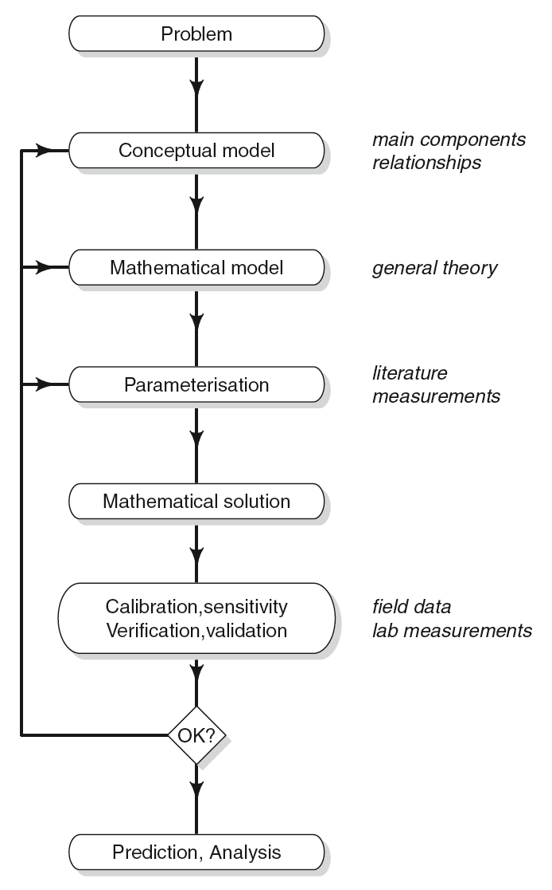

This document has been separated out from `equations.Rmd` to provide a workspace in which to experiment with modelling and partial differential equations. It is also set up as a space to run example code from the textbook "A Practical Guide to Ecological Modelling", which includes R code. 

See also: 
https://cran.r-project.org/web/packages/diffEq/vignettes/ODEinR.pdf
https://cran.r-project.org/web/packages/deSolve/vignettes/deSolve.pdf


## First, a practice problem with ReacTran and partial differential equations 

https://journal.r-project.org/archive/2010-2/RJournal_2010-2_Soetaert~et~al.pdf

From 

To solve a 1-D diffusion-reaction model:  

$$\frac{\partial C}{\partial t} = \frac{\partial}{\partial x} \left(D\frac{\partial C}{\partial x}\right) -Q$$

with C the concentration, t the time, x the distance from the origin, Q, the consumption rate, and with boundary conditions (values at the model edges):

$$ \frac{\partial C}{\partial x} _{x=0} = 0 $$
$$ C _(x=10) = C _{ext} $$

```{r}

# To solve this model in R, first the 1-D model Grid is defined; it divides 10 cm (L) into 1000 boxes (N). 

library(ReacTran)
Grid <- setup.grid.1D(N = 1000, L = 10)

# The model equation includes a transport term, approximated by ReacTran function tran.1D and a consumption term (Q). The downstream boundary condition, prescribed as a concentration (C.down) needs to be specified, the zero-gradient at the upstream boundary is the default:

 pde1D <-function(t, C, parms)  {
   tran <- tran.1D(C = C, D = D,
                   C.down = Cext, dx = Grid)$dC
   list(tran - Q)  # return value: rate of change
 }
 
# The model parameters are:
 
D <- 1 # diffusion constant 
Q <- 1 # uptake rate
Cext <- 20 # still not sure what this value means

# In a first application, the model is solved to steady-state, which retrieves the condition where the concentrations are invariant (i.e. replace left side of the model equation above, partial C / partial t, with zero, equal to the right side.)

# In R, steady-state conditions can be estimated using functions from package rootSolve which implement amongst others a Newton-Raphson algorithm (Press et al., 2007). For 1-dimensional models, steady.1D is most efficient. The initial “guess” of the steady-state solution (y) is unimportant; here we take simply N random numbers. Argument nspec = 1 informs the solver that only one component is described.

# Although a system of 1000 equations needs to be solved, this takes only a fraction of a second:


 library(rootSolve)
 print(system.time(
 std   <- steady.1D(y = runif(Grid$N),
   func = pde1D, parms = NULL, nspec = 1)
 ))
 
# The values of the state-variables (y) are plotted against the distance, in the middle of the grid cells (Grid$x.mid).
 
 plot (Grid$x.mid, std$y, type = "l",
   lwd = 2, main = "steady-state PDE",
   xlab = "x", ylab = "C", col = "red")
 
 # The analytical solution compares well with the numerical approximation:
 
analytical <- Q/2/D*(Grid$x.mid^2 - 10^2) + Cext
 max(abs(analytical - std$y))
 
 # Next the model is run dynamically for 100 time units using deSolve function ode.1D, and starting with a uniform concentration:
 
require(deSolve)
times <- seq(0, 100, by = 1)
system.time(
  out <- ode.1D(y = rep(1, Grid$N),
    times = times, func = pde1D,
    parms = NULL, nspec = 1)
)

# Here, out is a matrix, whose 1st column contains the output times, and the next columns the values of the state variables in the different boxes; we print the first columns of the last three rows of this matrix:

tail(out[, 1:4], n = 3)

# We plot the result using a blue-yellow-red color scheme, and using deSolve’s S3 method image. Fig- ure 6 shows that, as time proceeds, gradients develop from the uniform distribution, until the system almost reaches steady-state at the end of the simulation.

 image(out, xlab = "time, days",
       ylab = "Distance, cm",
       main = "PDE", add.contour = TRUE)
 
# It should be noted that the steady-state model is effectively a boundary value problem, while the transient model is a prototype of a “parabolic” partial differential equation (LeVeque, 2007).
# Whereas R can also solve the other two main classes of PDEs, i.e. of the “hyperbolic” and “ellip- tic” type, it is well beyond the scope of this paper to elaborate on that.
 
```

## Notes from "A Practical Guide to Ecological Modelling"

```{r}
library(ecolMod) # contains material from textbook 
```

* Recall: _solving_ a model means finding the actual value of something (biomass, concentration etc.) from an expression that tells you its rate of change through space or time (i.e. a differential equation). 
* Usually it is not very difficult to generate a hypothesis (or even ten hypotheses) when we are confronted with experimental data. The real problem is to ensure that the hypothesis is really consistent with the data at hand, and to generate hypotheses that are of wider validity than the specific experimental system. It is here that models can play a crucial role. In our quest to determine whether our understanding of the system is valid, and to convince our colleague scientists, we often go beyond the qualitative description and use a model to demonstrate our right. If your colleagues are easily convinced, this model can be some rough (back-of-the-envelope) calculation; else it should be quite sophisticated.
* It is generally much easier to measure concentrations or densities, rather than process rates but often the rates are the quantities that we want to determine. Fortunately, both are related: concentration gradients arise due to the processes which consume or produce the substances. Mathematical models describe how these processes affect the substances. Thus, if the output of these models is fitted to the concentration data, it may be possible to obtain quantitative estimates of the process rates. In this way, something that is easily measurable (the concentration) is translated into something hard to quantify (the rate) by means of a (set of) mathematical equation(s).
* This indicates that the interaction between models and data is very important. Not only do we need data to test the model and if necessary to refute it, equally important are data for driving (forcing) the model or providing good parameter values. Successful modelling in ecology is almost always iterative: the initial versions of a model highlight areas of uncertainty and weakness, which can then be addressed in later versions. Although one may discern several successive phases in model making, it is possible that these phases need to be cycled through (iterated) several times, before we can be content with the result. 
* An equation is dimensionally homogeneous and has consistent units if the units and quantities on two sides of an equation balance. It is not allowed to add, for instance, length to area, or concentration to flux in one equation (dimensional homogeneity). Moreover, it is not allowed to add grams to kilograms, or to add mol m−3 to kg m−3 (consistency of units). We can use the principle of dimensional homogeneity and consistency of units in two ways: 1, To test whether an equation makes sense, and 2, To derive the (unknown) units of a quantity.
* Rate-limiting terms, which are common components of ecological models that introduce biological complexity (making the modeling concepts imported from chemical reactions more realistic), can be expressed as a function of the consumer concentration (the sink) itself (functional response) or of the resource (carrying capacity). There are also rate-inhibiting terms, capturing processes like oxygen and anaerobic respiration. 

The concepts of building a model: 
1. The creation of a new model generally takes off with simplifying the system, i.e. the writing of the conceptual model.
1. The interactions and flows defined in the conceptual model must be formulated explicitly as mathematical expressions in the next step (formulating the mathematical model). Generally, the model will be written as a (set of) differential equation(s) in the form $dC/dt = sources-sinks$. This is based on the conservation law, although it does not always hold for ecological models. 
1. In a next step (parameterization) these parameters must be assigned values, either on the basis of measurements, obtained from the literature or using an estimation procedure, based on the model itself (calibration).
1. After we have chosen the appropriate mathematical equations and have decided on the values of the parameters, we may look for a method that will give a mathematical solution to the problem. Once we have found such solution, we will be able to calculate how the variables of interest evolve through time, based on the dynamics that were chosen in the previous steps.
1. After this step, the model will produce output, and this may be compared to field or experimental data as a check that the model is an accurate representation of the real system, and that it behaves as we want it to. This will be done in model validation.
1. A number of other tests on the internal consistency of the model, its ability to reproduce known solutions, its conformity to conservation laws etc. . . are also performed at this step (model verification). We also test how sensitive the model is to certain formulations or parameters (sensitivity analysis), and we may use model output as a means to obtain better values for the parameters (model calibration).
1. After carefully checking the behaviour and output of the model, we then either cycle through the process and reformulate the model or decide that it is good enough for model application. Here we may use it to predict a system’s behaviour under different scenarios, to analyse the dynamics of certain interactions, to make budgets, or for quantification of unmeasured processes.




State variables are those variables that appear on the left-hand side of the model equations as time derivatives: we specify their rate of change in the model (see later), and after model solution will determine their values in time.
Time derivatives of a state variable represent the ‘speed’ at which the value of the state variable will change over an infinitesimal time period (dt) and are represented as $dStateVariable / dt$. 

State variables for this project: 
* Larval concentration per unit area of ocean, $L$ 
* Adults per unit length of shoreline, $B$ 
* Larval concentration immediately adjacent to shoreline $L_{shore}$ 

In addition to state variables, a model generally contains output variables. These often relate to measured quantities, and allow comparison of the model to reality. In addition, output variables can be instantaneous rates that one wants to inspect, or long-term averaged rates. They are computed based on other components of the model (forcing functions, state variables, parameters).

Output variables for this project: 
* 


